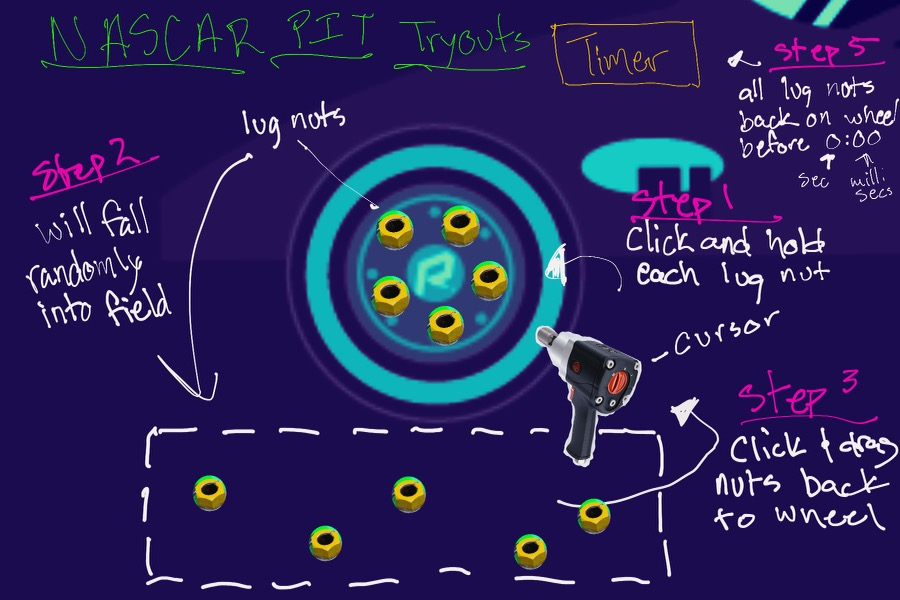

# NASCAR™ Pit Tryouts

## Lets get luggin ...

#### You feel the roars of the engines. You smell the burning of the tires. Your andreline is kicking. You've been a NASCAR™ fan since you could sit in the stands and now you're in the pits. 

#### Today you will be trying out to be a pit stop tire changer. You've been practicing the moves for weeks and today you will be picking up an impact gun and kicking some nuts loose!

#### But if you can't beat the clock, you won't be suiting up for a raceday any time soon. Your job is to loosen every lug nut off the car's' wheel, pickup the the fallen lug nuts, zap them back onto the wheel ... __all before the clock reaches 0!__

---

## Click link to try game:
<!-- link to game deploy -->
__[Nascar-pit-tryouts](https://carlos-villatoro.github.io/nascar-pit-tryouts/)__

---

## Created using:
* HTML5
    * Canvas
* CSS 
* JavaScript
    * DOM Manipulation 

#### The approch to this game was to keep the DOM Manipulation in JavaScript simple. All the game variables created with an object class. Their locations were hardcoded with direct coordinates. Mousedown events were used to track the location of the mouse click in relation to the location of the game pieces. Those locations were cleared when clicked, and a 'alive' boolean was used to track their playing status. The win event was created once all game statuses were equal, the countdown was greater than 0, and the last instruction was followed. The lose event was created by listening for a click event after the countdown reached 0.

####  The game's timer and win/lose statement were displayed by using query selectors to fill in the innerText of HTML elements.
---
## Original Wireframe and Goals

## MVP

* Create a cursor controlled game
* Create a landing page with a start and restart button
* Create a canvas area to play the game in
* Change cursor within game area to impact gun
* Create mouse events for clicking and dragging lug nuts
* Start timer upon first mouse click
* Have lug nuts move when clicked and dragged
* Create a random field for after lug nuts have been removed to fall into
* Have hitboxes that lug nuts need to be dragged and held at
* Stop timer when all lug nuts are back on wheel
* Create a win event if timer is not 0:00, record time task was completed in
* Create a lose even if timer reaches 0:00 before player completes task
* Restart button should reset game, and save fastest time

## Stretch Goals

* Have different difficulty levels, causing timer to be faster
* Have game be multi-player
    * Each persons time gets saved - if they beat the clock
    * Have leaderboard of times (including DNFs)
* Animate wheel to move out and into game area 1
* Add sound to the click and hold

## Forseeable Roadblacks

* Creating lug nut object hitboxes and wheel hitboxes for each lugnut
* Getting correct combination of mouse events 
* Having game stop and not be playable upon lose - timer runs out
* Having lug nuts not fall outside of the random field

---
## Post-project Reflection

### Unsolved problems:
* Drag events were not created
* Custom cursor was not implemented (to display at all times within game area, not just on click)
* A restart button was not implemented
* Stretch goals were not met

### Growth Areas
* Understanding of syntax of variables in relation to functions
* Usage of object oriented variables using classes to set game status
* Understanding of order of JS functions
    * Placing variables in correct area of code to be use globally or locally
* Control Flow 
* Time Management

---
## Sources Used

#### https://bencentra.com/2017-07-11-basic-html5-canvas-games.html
* Helped with understanding control flow and and placement of game functions
* Used in conjuction with previous class material
#### https://developer.ibm.com/tutorials/wa-games/#download
* Used to understand mouse events 

#### Various https://w3schools.com and https://developer.mozilla.org/ guides and refernces were used for documentation on mouse events, interval control, canvas manipulation, and many other functions. 

